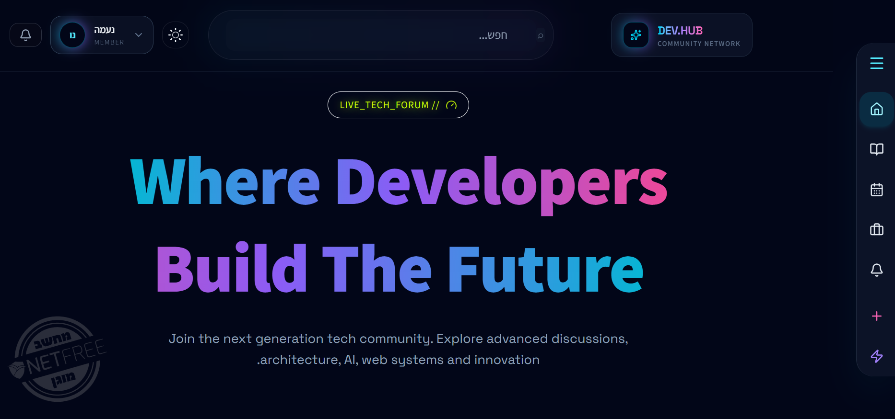
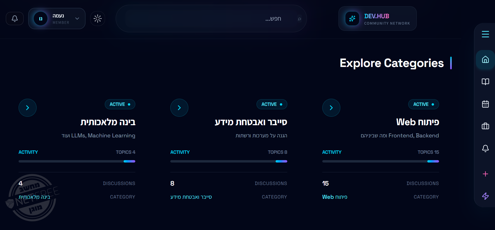
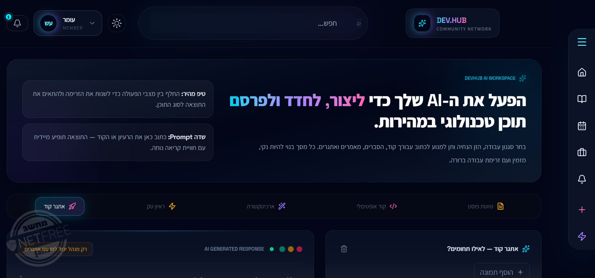
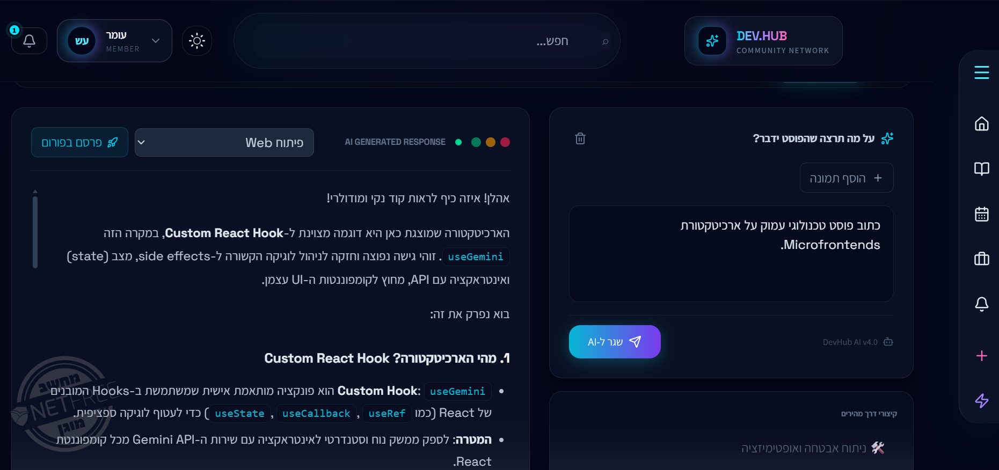
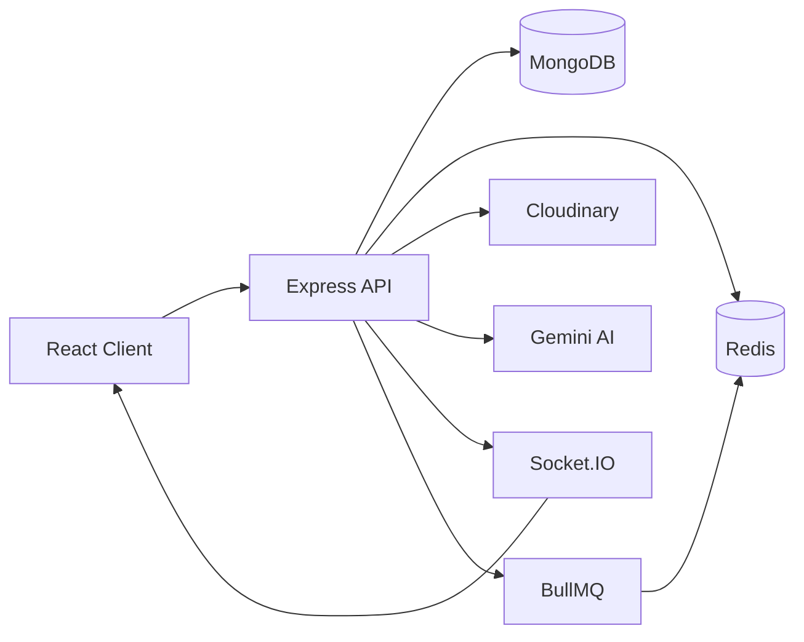
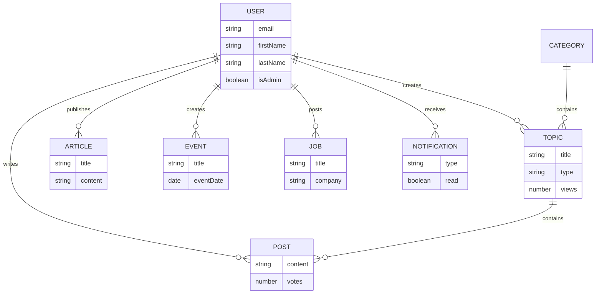
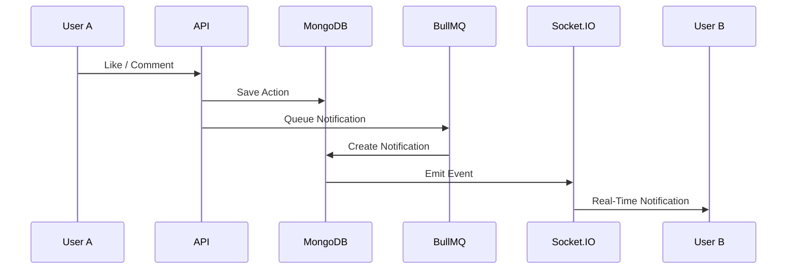
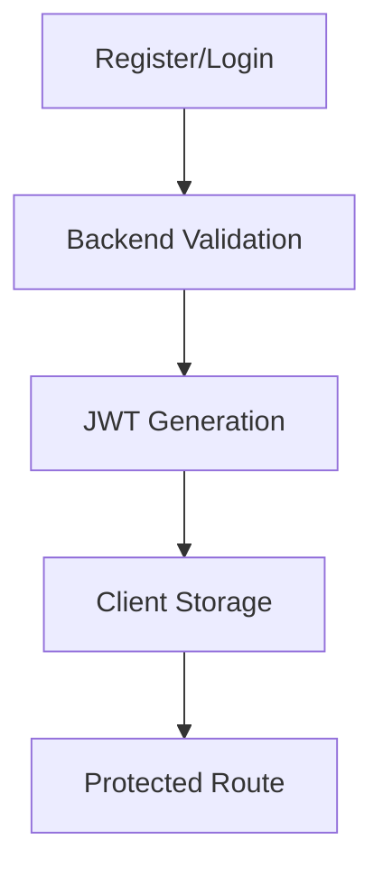

<div align="center">

# 🚀 Mini Forum

### Full-Stack Community Platform with Real-Time Features, AI Integration & Scalable Architecture

[]()
[]()
[]()
[]()
[]()
[]()
[]()
[]()

A modern full-stack community platform that combines discussion forums, articles, events, job postings, AI-powered assistance, real-time notifications, and scalable backend architecture.

</div>

---

# 📸 Screenshots

## Home Page



## Topic Discussion





## AI Assistant





---

# ✨ Features

## 🔐 Authentication

- JWT Authentication
- Secure password hashing with bcrypt
- Google OAuth Login
- Protected Routes
- User Profiles

---

## 💬 Forum System

- Categories
- Topics
- Posts
- Replies
- Likes
- Views Counter
- Pinned Topics
- Closed Topics

---

## 📰 Articles

- Create Articles
- Categories
- Tags
- Comments
- Likes
- View Tracking

---

## 📅 Events

- Publish Community Events
- Attendance Tracking
- Event Likes
- Event Comments

---

## 💼 Jobs Board

- Job Listings
- Employment Types
- Company Information
- Apply Links
- Comments & Likes

---

## 🤖 AI Integration

Powered by Google Gemini.

Features:

- AI Requests
- Usage Tracking
- Rate Limiting
- Dedicated AI Endpoints

---

## 🔔 Real-Time Notifications

Socket.IO based notifications.

Supports:

- Likes
- Comments
- Event Attendance
- Direct Notification Delivery

---

## ☁️ File Uploads

Cloudinary Integration

Supports:

- Image Upload
- Storage Metadata
- Upload Tracking

---

## 🔍 Search

Global search across:

- Topics
- Articles
- Events
- Jobs

Rate-limited for security.

---

## ⚡ Performance

- Redis Caching
- BullMQ Background Jobs
- Indexed MongoDB Queries
- Optimized API Design

---

# 🛠 Tech Stack

## Frontend

| Technology | Purpose |
|------------|----------|
| React 19 | UI |
| Vite | Build Tool |
| React Router | Routing |
| React Query | Data Fetching |
| Axios | HTTP Requests |
| Socket.IO Client | Realtime |
| Recharts | Analytics |

---

## Backend

| Technology | Purpose |
|------------|----------|
| Node.js | Runtime |
| Express | API |
| MongoDB | Database |
| Mongoose | ODM |
| Redis | Cache |
| BullMQ | Queues |
| Socket.IO | Realtime |
| JWT | Authentication |
| Google OAuth | Login |
| Cloudinary | Storage |
| Gemini API | AI |

---

# 🏗 Architecture



---

# 🗄 Database ERD



---

# 🔄 Notification Flow



---

# 🔐 Authentication Flow



---

# 📂 Project Structure

```text
mini-forum
│
├── backend
│   ├── config
│   ├── controllers
│   ├── middleware
│   ├── models
│   ├── queues
│   ├── routes
│   ├── services
│   ├── utils
│   └── app.js
│
├── frontend
│   ├── src
│   │   ├── components
│   │   ├── pages
│   │   ├── hooks
│   │   ├── contexts
│   │   ├── services
│   │   └── assets
│
└── README.md
```

---

# 🚀 Installation

## Clone

```bash
git clone https://github.com/Naama00/mini-forum.git
cd mini-forum
```

---

## Install Dependencies

```bash
npm install

cd frontend
npm install
```

---

## Environment Variables

Create:

```env
PORT=5000

JWT_SECRET=

GOOGLE_CLIENT_ID=

GEMINI_API_KEY=

REDIS_URL=

CLOUDINARY_CLOUD_NAME=
CLOUDINARY_API_KEY=
CLOUDINARY_API_SECRET=
```

---

## Run

Backend:

```bash
npm run dev
```

Frontend:

```bash
cd frontend
npm run dev
```

---

# 📡 API Modules

### Authentication

```http
POST /api/auth/register
POST /api/auth/login
POST /api/auth/google
```

### Forum

```http
GET /api/topics
POST /api/topics

GET /api/posts
POST /api/posts
```

### Articles

```http
GET /api/articles
POST /api/articles
```

### Events

```http
GET /api/events
POST /api/events
```

### Jobs

```http
GET /api/jobs
POST /api/jobs
```

### AI

```http
POST /api/gemini
GET /api/usage
```

### Uploads

```http
POST /api/uploads
```

---

# 🧠 Challenges & Solutions

## Challenge 1: Real-Time Notifications

### Problem

Users needed immediate feedback when receiving likes, comments, or event interactions.

### Solution

Implemented:

- Socket.IO
- Notification Queue
- Redis-backed processing
- User-specific channels

Result:

- Near-instant notification delivery
- Reduced API polling

---

## Challenge 2: AI Abuse Prevention

### Problem

AI endpoints can be expensive and vulnerable to abuse.

### Solution

Implemented:

- AI-specific Rate Limiter
- Usage Tracking
- Dedicated Gemini middleware

Result:

- Controlled API costs
- Improved reliability

---

## Challenge 3: Scalability

### Problem

Frequent database reads can become expensive.

### Solution

Integrated:

- Redis caching
- MongoDB indexes
- Background processing with BullMQ

Result:

- Faster response times
- Reduced database load

---

# 🔮 Future Improvements

- Private Messaging
- Advanced Moderation Dashboard
- User Reputation System
- Bookmarking
- Recommendation Engine
- Full Analytics Dashboard
- Email Notifications

---

# 👩‍💻 Author

**Naama**

Full-Stack Developer

GitHub:
https://github.com/Naama00

---

# 📄 License

This project was created for educational, portfolio, and learning purposes.